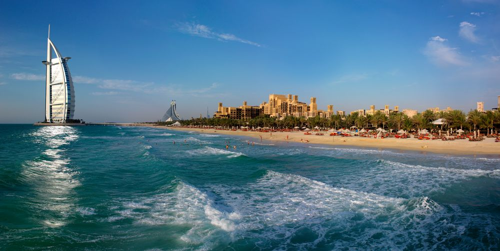
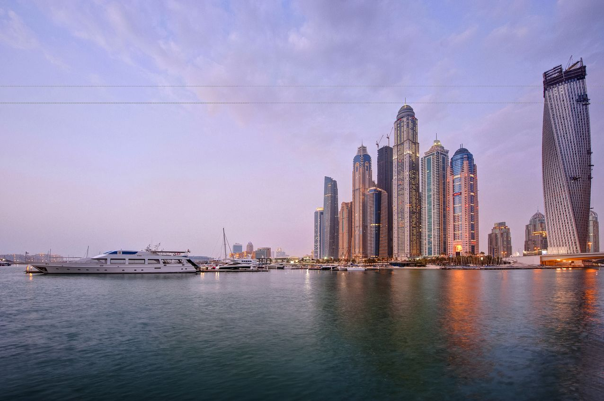
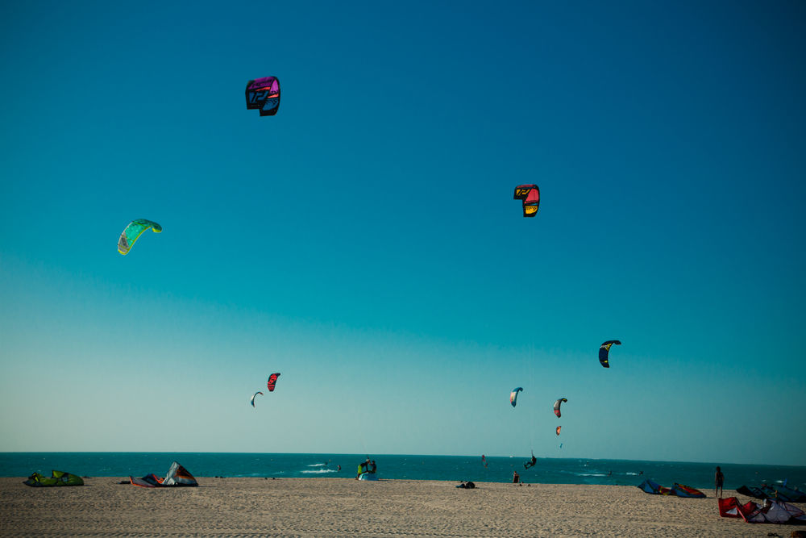
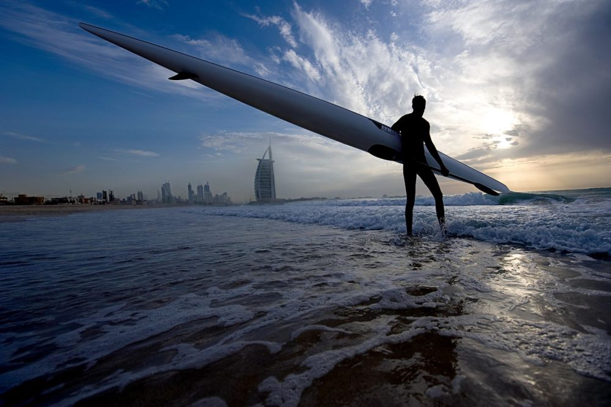

# Dubai's best beaches

## Unknown aspects of Dubai beach life

Nature has endowed the coastal zone of the Arab Emirates with fabulous beaches. Sparkling white sand, clear sea water and a smooth decline in depth make hot Dubai a great place for a beach holiday. Everything that nature failed to do is carefully replenished by human creations: comfortable sun loungers, umbrellas freely scattered on the sandy expanses and strict systems of water purification from accidental litter and the tiniest algae.

Many beaches are famous for their entertainment and lively atmosphere, and therefore are popular among tourists and residents of the metropolis. However, there are many secluded places left in Dubai, where you managed to preserve the pristine elegance, which permeates the combination of snow-white sand and translucent aquamarine of the Persian Gulf. What to choose is up to you.

The number one beach in Dubai is Jumeirah Beach Residence (JBR). The sea here is always calm - just what fans are looking for a swim in the heat. Hotels near the Jumeirah Beach Residence offer water activities for all tastes, so visitors to the beach always have the opportunity to fly a boat on a paraglider, sign up for a wakeboarding lesson or ride on an inflatable banana. Marine entertainment combined with a wide selection of cafes and restaurants make this beach a favorite place for families. A ride along the beach is a welcome addition, as you always have the chance to meet one of the camels that live in the Jumeirah Beach Residence.

The beach is located in the Dubai Marina area.

## Kite Beach

From the name of this beach it is easy to guess that it is the place for fans of kitesurfing. Professional athletes, beginners surfers and enthusiastic spectators come to Dubai especially on Kite Beach for their favorite sport. There are a lot of schools and companies renting necessary equipment so that anyone can challenge the azure waters and hot winds of the Arabian Gulf. The best time for classes is in the afternoon, when the wind is getting stronger and the sea is excited just in time for kitesurfing. Those who like to watch spectacular tricks from the side will pay attention to the colorful scenery: against the background of the Burj Al Arab skyscraper the colorful wings of paragliders look especially spectacular.

The beach is located across the street from the road junction Al Manara.

## Umm Suqeim Park Beach

Picturesque beach Umm Suqeim Beach sheltered in the shadow of the famous tower Burj Al Arab. This is one of the most successful places for photo shoot on vacation. In addition to the picturesque landscape, this place is famous for its winds, which attract surfers and windsurfers, and beginners conquerors of the waves here learn their boards in the morning in the cooler seasons. Near Umm Suqeim Park Beach there is a cozy park, which on hot days gives the long-awaited coolness and contrasts with its greenery and white soft beach sand.

The beach is located on Al Thanya Street, next to Jumeirah Beach Hotel, opposite the Umm Suqeim Park.
